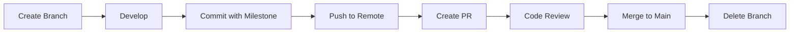

# Branch Structure Guide 🌿

คู่มือการจัดการ Branch สำหรับโปรเจค MeeChain_MeeBot พร้อมระบบ fallback-aware และ sprite feedback

## 🧱 โครงสร้าง Branch ที่แนะนำ

### Branch Types และ Naming Convention

| ประเภทงาน | Prefix | ตัวอย่าง | คำอธิบาย |
|-----------|--------|----------|----------|
| **ฟีเจอร์ใหม่** | `feature/` | `feature/tts-badge`<br>`feature/ipfs-uploader` | สำหรับพัฒนาฟีเจอร์ใหม่ |
| **แก้บั๊ก** | `fix/` | `fix/npm-test-issue`<br>`fix/jekyll-sass-error` | สำหรับแก้ไขบั๊กและปัญหา |
| **ปรับปรุงโค้ด** | `refactor/` | `refactor/deploy-dashboard`<br>`refactor/metadata-generator` | สำหรับ refactor โค้ดโดยไม่เปลี่ยน functionality |
| **ทดสอบ** | `test/` | `test/meechain-trigger`<br>`test/fallback-viewer` | สำหรับเพิ่มหรือแก้ไข tests |
| **เอกสาร** | `docs/` | `docs/deploy-guide`<br>`docs/minting-flow` | สำหรับอัปเดตเอกสาร |

## ✅ Best Practices

### 1. Branch Naming
- ใช้ชื่อที่สั้น กระชับ และอธิบายงานได้ชัดเจน
- ใช้ `-` (dash) แทนช่องว่าง
- ใช้ตัวอักษรเล็กทั้งหมด
- ห้ามใช้อักขระพิเศษ เช่น `@`, `#`, `$`

**ตัวอย่างที่ดี:**
```bash
feature/nft-minting-pipeline
fix/badge-fallback-chain
refactor/quest-verification
```

**ตัวอย่างที่ไม่ดี:**
```bash
feature/New_Feature  # มีตัวพิมพ์ใหญ่และ underscore
fix-bug              # ขาด prefix
MyBranch             # ไม่มี prefix และใช้ตัวพิมพ์ใหญ่
```

### 2. Fallback-Aware Commits

**ทุก branch ควรมี fallback-aware commit messages** เพื่อให้ระบบ MeeBot แสดงผลได้ถูกต้อง

```bash
# ตัวอย่าง commit message ที่ดี
git commit -m "feat: Add NFT minting with fallback support"
git commit -m "fix: Resolve fallback chain connection issue"
git commit -m "refactor: Improve badge minter with fallback aware logging"
git commit -m "M2: NFT minting pipeline complete 🚀"
```

### 3. Milestone Integration

เชื่อมโยง branch กับ milestone โดยใช้ commit message หรือ milestone.log:

```bash
# วิธีที่ 1: Commit Message
git commit -m "M1: Deploy dashboard initialized ✅"

# วิธีที่ 2: Milestone Log
echo "🎉 M2 complete: Minting pipeline ready!" >> milestone.log
git add milestone.log
git commit -m "Update milestone: M2 complete"
```

## 🔄 Workflow Recommendations

### สร้าง Branch ใหม่

```bash
# จาก main branch
git checkout main
git pull origin main

# สร้าง feature branch
git checkout -b feature/my-new-feature

# สร้าง fix branch
git checkout -b fix/my-bug-fix
```

### Development และ Commits

```bash
# ทำงานและ commit เป็นระยะ
git add .
git commit -m "feat: Add initial implementation"

# Push to remote
git push origin feature/my-new-feature
```

### Merge เข้า Main

```bash
# ก่อน merge ให้ sync กับ main
git checkout main
git pull origin main
git checkout feature/my-new-feature
git merge main

# แก้ conflict (ถ้ามี)
# จากนั้น push
git push origin feature/my-new-feature

# สร้าง Pull Request บน GitHub
# หลังจาก review และ approve แล้ว merge เข้า main
```

## 🎯 Milestone-Linked Branches

สำหรับ branch ที่เชื่อมโยงกับ milestone ให้ทำตามนี้:

```bash
# สร้าง branch สำหรับ M1
git checkout -b feature/m1-deploy-dashboard

# ทำงานและ commit
git commit -m "M1: Add /docs/index.html with fallback viewer"
git commit -m "M1: Configure deploy dashboard settings"

# เมื่อเสร็จสมบูรณ์
echo "🟢 M1 complete: Deploy dashboard online!" >> milestone.log
git add milestone.log
git commit -m "M1: Deploy Dashboard Complete 🚀"
```

## 🤖 MeeBot Sprite Feedback

เมื่อทำงานเสร็จในแต่ละ milestone MeeBot จะแสดง sprite feedback:

- **M1**: 🟢 MeeBot (happy sprite): "Deploy dashboard online!"
- **M2**: 🟣 MeeBot (excited sprite): "Minting pipeline ready!"
- **M3**: 🟠 MeeBot (proud sprite): "Milestone linked!"
- **M4**: 🔵 MeeBot (confident sprite): "Fallback validated!"
- **M5**: 🟡 MeeBot (celebration sprite): "Production ready!"

## 📋 Branch Lifecycle



## 🛡️ Protection Rules

สำหรับ **main** branch:
- ✅ Require pull request reviews
- ✅ Require status checks to pass
- ✅ Require branches to be up to date
- ❌ No direct pushes to main

## 📚 เอกสารที่เกี่ยวข้อง

- [MILESTONE_GUIDE.md](MILESTONE_GUIDE.md) - คู่มือ Milestone และ Sprite Feedback
- [CONTRIBUTING.md](CONTRIBUTING.md) - คู่มือการ Contribute (ถ้ามี)
- [README.md](README.md) - เอกสารหลักของโปรเจค

## 🚀 Quick Reference

```bash
# สร้าง feature branch
git checkout -b feature/my-feature

# Commit with milestone marker
git commit -m "M1: Feature implementation"

# Update milestone log
echo "🎉 M1 complete: Feature ready!" >> milestone.log

# Push และสร้าง PR
git push origin feature/my-feature
```

---

**หมายเหตุ:** คู่มือนี้เป็นส่วนหนึ่งของระบบ fallback-aware และ MeeBot sprite feedback integration 🤖✨
