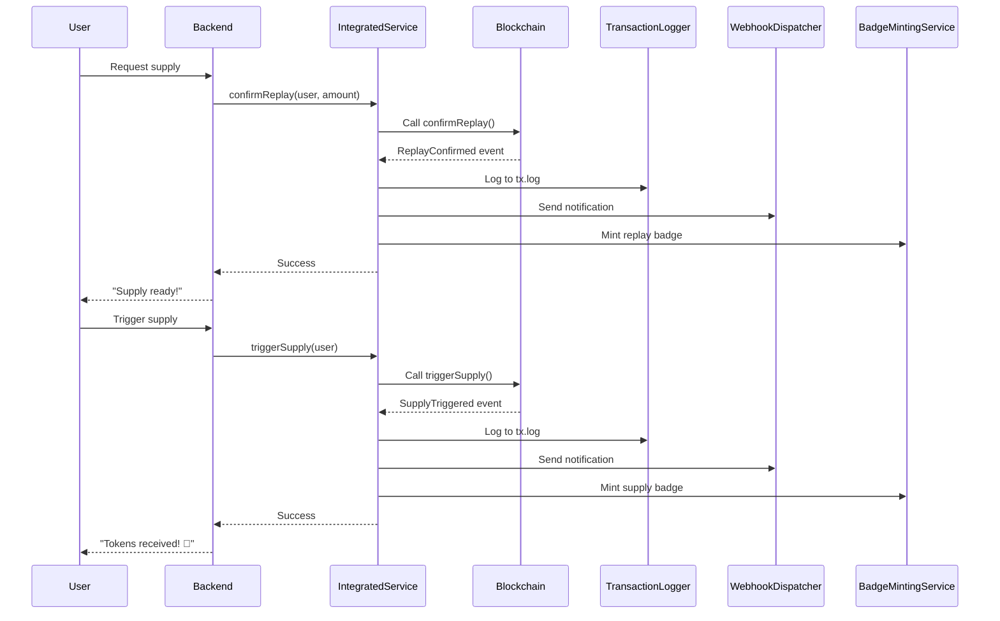

# MeeChain Integrated Supply System

## 🎯 Overview

The **Integrated Supply System** is a comprehensive solution that combines blockchain interactions, structured logging, webhook notifications, signature-based refunds, and automated badge minting into a unified interface. Built with **ethers.js** for modern blockchain interactions.

## 🏗️ Architecture

```
┌─────────────────────────────────────────────────────────────┐
│              IntegratedSupplyService                        │
│                 (Unified Interface)                         │
└─────────────────────────────────────────────────────────────┘
                          │
         ┌────────────────┼────────────────┐
         │                │                │
    ┌────▼────┐     ┌────▼────┐     ┌────▼────┐
    │MeeChain │     │Transaction│   │Webhook  │
    │Supply   │     │Logger    │    │Dispatcher│
    │Service  │     │          │    │         │
    └────┬────┘     └─────────┘     └─────────┘
         │
    ┌────▼────┐     ┌────────────┐
    │Signature│     │Badge       │
    │Refund   │     │Minting     │
    │Service  │     │Service     │
    └─────────┘     └────────────┘
```

## 📦 Components

### 1. MeeChainSupplyService
- **Purpose**: Blockchain interactions using ethers.js
- **Features**:
  - Confirm replay verification
  - Trigger token supply
  - Issue refunds
  - Event listening
  - Automatic retry with configurable attempts
  - Fallback mechanisms

### 2. TransactionLogger
- **Purpose**: Structured transaction logging
- **Format**: JSONL (JSON Lines)
- **Features**:
  - Automatic logging of all transactions
  - Query by user, action, or status
  - Real-time log streaming
  - Audit trail for compliance

### 3. WebhookDispatcher
- **Purpose**: Event notification system
- **Features**:
  - HTTP POST webhooks
  - Automatic retry on failure
  - Configurable timeout
  - Status tracking

### 4. SignatureRefundService
- **Purpose**: Off-chain refund approval
- **Features**:
  - EIP-712 typed signatures
  - Nonce tracking
  - Expiry validation
  - Signature verification

### 5. BadgeMintingService
- **Purpose**: Automated badge rewards
- **Features**:
  - Mint badges on successful operations
  - First-time user special badges
  - Dynamic metadata generation
  - Fallback minting on failure

## 🚀 Quick Start

### Installation

```bash
# Install dependencies
npm install ethers dotenv

# Copy ABI files
npm run export-abi MeeChainSupply
```

### Configuration

Create a `.env` file:

```env
RPC_URL=https://data-seed-prebsc-1-s1.binance.org:8545/
PRIVATE_KEY=your-private-key
CONTRACT_ADDRESS=deployed-contract-address
WEBHOOK_URL=https://your-webhook-url.com  # Optional
```

### Basic Usage

```typescript
import { IntegratedSupplyService } from './src/services/IntegratedSupplyService.js';

// Initialize service
const service = new IntegratedSupplyService({
  rpcUrl: process.env.RPC_URL!,
  privateKey: process.env.PRIVATE_KEY!,
  contractAddress: process.env.CONTRACT_ADDRESS!,
  chainId: 97, // BSC Testnet
  webhookUrl: process.env.WEBHOOK_URL,
  badgeMintingEnabled: true,
  badgeNetwork: 'polygon'
});

// Confirm replay
const result = await service.confirmReplay(
  '0xUserAddress',
  '100' // 100 tokens
);

// Trigger supply
await service.triggerSupply('0xUserAddress');

// Issue refund (if needed)
await service.refund('0xUserAddress');
```

## 📝 Transaction Logging

All transactions are automatically logged to `logs/tx.log` in JSONL format:

```json
{"user":"0xabc...","action":"replay","txHash":"0x123...","status":"success","timestamp":1697654321}
{"user":"0xdef...","action":"supply","txHash":"0x456...","status":"success","timestamp":1697654322}
{"user":"0xghi...","action":"refund","txHash":"0x789...","status":"failed","timestamp":1697654323}
```

### Query Logs

```typescript
// Get all transactions for a user
const userLogs = service.getUserLogs('0xUserAddress');

// Get pending transactions
const pendingLogs = service.getLogsByStatus('pending');

// Get failed transactions
const failedLogs = service.getLogsByStatus('failed');
```

### Real-time Monitoring

```bash
# Watch logs in real-time with jq
tail -f logs/tx.log | jq

# Filter by user
tail -f logs/tx.log | jq 'select(.user == "0xUserAddress")'

# Filter by status
tail -f logs/tx.log | jq 'select(.status == "success")'
```

## 📡 Webhook Integration

Webhooks are automatically sent for all events:

### Webhook Payload

```json
{
  "user": "0xUserAddress",
  "action": "supply",
  "txHash": "0x123...",
  "status": "success",
  "amount": "100",
  "timestamp": 1697654321
}
```

### Configuration

```typescript
const service = new IntegratedSupplyService({
  // ... other config
  webhookUrl: 'https://your-webhook-url.com'
});
```

### Retry Mechanism

- Default: 3 attempts
- Delay: 2 seconds between retries
- Timeout: 10 seconds per request

## 🔐 Signature Refunds

Generate off-chain signatures for refund approvals:

```typescript
// Generate signature
const signature = await service.generateRefundSignature(
  '0xUserAddress',
  '50',  // 50 tokens
  3600   // Expires in 1 hour
);

console.log(signature);
// {
//   user: '0xUserAddress',
//   amount: '50',
//   nonce: 1,
//   signature: '0x...',
//   expiry: 1697654321
// }

// Verify signature
const isValid = await service.verifyRefundSignature(signature);
```

### Nonce Tracking

- Nonces are stored in `logs/nonces.json`
- Automatically incremented per user
- Prevents replay attacks

### EIP-712 Typed Data

The service uses EIP-712 for secure signature generation:

```typescript
{
  domain: {
    name: 'MeeChainSupply',
    version: '1',
    chainId: 97,
    verifyingContract: '0x...'
  },
  types: {
    Refund: [
      { name: 'user', type: 'address' },
      { name: 'amount', type: 'uint256' },
      { name: 'nonce', type: 'uint256' },
      { name: 'expiry', type: 'uint256' }
    ]
  }
}
```

## 🏅 Badge Minting

Badges are automatically minted on successful operations:

### Badge Types

1. **replay-verified** - Minted when replay is confirmed
2. **supply-completed** - Minted when supply is triggered
3. **first-supply-pioneer** - Special badge for first-time users

### Configuration

```typescript
const service = new IntegratedSupplyService({
  // ... other config
  badgeMintingEnabled: true,
  badgeNetwork: 'polygon'
});
```

### Manual Badge Operations

```typescript
// Check if user has first supply badge
const hasFirstBadge = service.badgeService.hasFirstSupplyBadge(userAddress);

// Enable/disable badge minting
service.setBadgeMintingEnabled(false);

// Generate custom metadata
const metadata = service.badgeService.generateBadgeMetadata(
  userAddress,
  'custom-badge',
  { custom: 'data' }
);
```

## 🔄 Event Listeners

The service automatically handles contract events:

```typescript
// Events are automatically processed:
// 1. ReplayConfirmed → Log + Webhook + Badge
// 2. SupplyTriggered → Log + Webhook + Badge
// 3. RefundIssued → Log + Webhook

// Manual event handling (optional)
service.supplyService.onEvent('ReplayConfirmed', (user, amount, event) => {
  console.log(`Replay confirmed for ${user}: ${amount} tokens`);
  console.log(`Transaction: ${event.log.transactionHash}`);
});
```

## 📊 Complete Flow



## 🧪 Testing

```bash
# Run all tests
npm test

# Run integrated supply service tests only
npm test tests/integratedSupplyService.test.ts

# Run with coverage
npm test -- --coverage
```

### Test Coverage

- ✅ Service initialization
- ✅ Transaction logging
- ✅ Webhook integration
- ✅ Signature refund system
- ✅ Badge minting
- ✅ Event listeners
- ✅ Complete flow integration
- ✅ Error handling

## 🛠️ API Reference

### IntegratedSupplyService

#### `constructor(config: IntegratedServiceConfig)`

Initialize the integrated service.

**Parameters:**
- `rpcUrl: string` - RPC endpoint URL
- `privateKey: string` - Private key for signing
- `contractAddress: string` - Contract address
- `chainId: number` - Chain ID
- `webhookUrl?: string` - Optional webhook URL
- `badgeMintingEnabled?: boolean` - Enable badge minting
- `badgeNetwork?: string` - Badge minting network

#### `confirmReplay(userAddress: string, amount: string)`

Confirm replay verification on-chain.

**Returns:** `Promise<ReplayVerificationResult>`

#### `triggerSupply(userAddress: string)`

Trigger token supply after replay confirmation.

**Returns:** `Promise<SupplyResult>`

#### `refund(userAddress: string)`

Issue refund if replay verification fails.

**Returns:** `Promise<RefundResult>`

#### `generateRefundSignature(userAddress: string, amount: string)`

Generate signature for off-chain refund approval.

**Returns:** `Promise<RefundSignature>`

#### `getContractState(userAddress: string)`

Get contract state for a user.

**Returns:** `Promise<ContractState>`

#### `getUserLogs(userAddress: string)`

Get transaction logs for a user.

**Returns:** `TransactionLog[]`

#### `close()`

Close all services and clean up listeners.

## 📁 File Structure

```
MeeChain_MeeBot/
├── src/
│   └── services/
│       ├── MeeChainSupplyService.ts      # Blockchain interactions
│       ├── TransactionLogger.ts          # Structured logging
│       ├── WebhookDispatcher.ts          # Webhook notifications
│       ├── SignatureRefundService.ts     # Signature refunds
│       ├── BadgeMintingService.ts        # Badge rewards
│       └── IntegratedSupplyService.ts    # Unified interface
├── abi/
│   └── MeeChainSupply.json               # Contract ABI
├── backend/abi/                          # Backend ABI copy
├── viewer/abis/                          # Frontend ABI copy
├── logs/
│   ├── tx.log                            # Transaction logs
│   └── nonces.json                       # Nonce tracking
├── tests/
│   └── integratedSupplyService.test.ts   # Test suite
├── examples/
│   └── integrated-supply-demo.js         # Usage examples
└── scripts/
    └── export-abi.js                     # ABI sync script
```

## 🎯 Benefits

| Feature | Benefit |
|---------|---------|
| Unified Interface | Single service for all operations |
| Automatic Logging | All transactions logged in JSONL format |
| Webhook Notifications | Real-time event notifications |
| Signature Refunds | Secure off-chain refund approvals |
| Badge Rewards | Automated badge minting |
| Event Listeners | Automatic handling of contract events |
| Retry Mechanism | Built-in retry for failed operations |
| Fallback Support | Fallback badge minting on failures |

## 🔗 Related Documentation

- [MEECHAIN_SUPPLY_GUIDE.md](./MEECHAIN_SUPPLY_GUIDE.md) - Complete guide
- [MEECHAIN_SUPPLY_QUICK_REFERENCE.md](./MEECHAIN_SUPPLY_QUICK_REFERENCE.md) - Quick reference
- [README.md](./README.md) - Project overview

## 📞 Support

For questions or issues:
- Run the demo: `node examples/integrated-supply-demo.js`
- Check tests: `npm test tests/integratedSupplyService.test.ts`
- Review examples in `examples/` directory

---

**Version**: 1.0.0  
**Last Updated**: 2025-10-19  
**Status**: ✅ Complete and Tested
