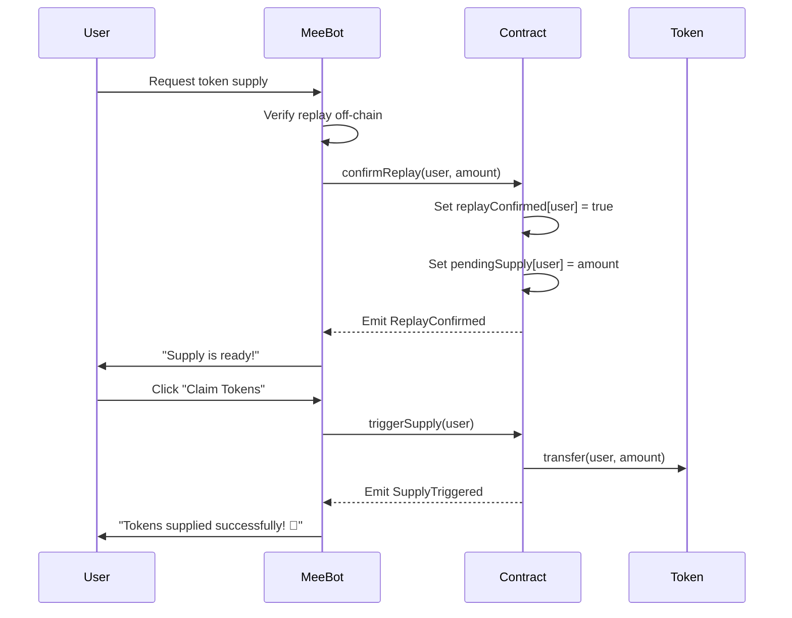
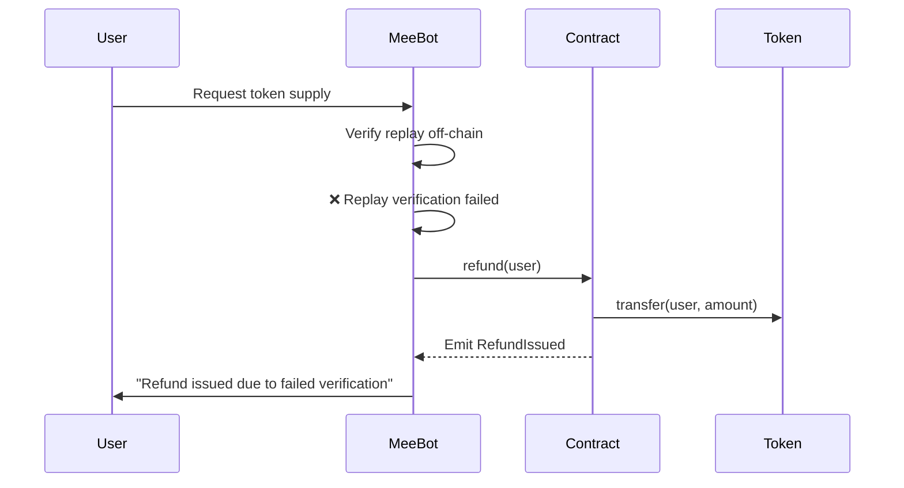

# MeeChain Supply System - Singapore Implementation

## 🎯 Overview

The **MeeChainSupply** contract provides a secure and transparent replay/supply system for MeeChain Singapore. It ensures that token supply operations are only executed after proper replay verification by MeeBot, preventing unauthorized or accidental token transfers.

## 🔐 Key Features

| Feature | Description |
|---------|-------------|
| **Replay Verification** | Off-chain replay verification by MeeBot before allowing supply |
| **Controlled Supply** | Two-step process: confirm replay → trigger supply |
| **Recovery Mechanism** | Refund function for failed replay verification |
| **Pending Balance** | Separates pending supply from actual transfers |
| **Event Logging** | Full transparency with on-chain event emissions |
| **Access Control** | onlyMeeBot modifier ensures authorized operations |

## 📝 Smart Contract

### Contract Address
- **Testnet**: Deploy using `scripts/deployMeeChainSupply.js`
- **Mainnet**: TBD

### Key Functions

#### 1. confirmReplay(address user, uint256 amount)
- **Caller**: MeeBot only
- **Purpose**: Confirms that replay verification passed off-chain
- **Events**: Emits `ReplayConfirmed(user, amount)`

```solidity
function confirmReplay(address user, uint256 amount) external onlyMeeBot {
    replayConfirmed[user] = true;
    pendingSupply[user] = amount;
    emit ReplayConfirmed(user, amount);
}
```

#### 2. triggerSupply(address user)
- **Caller**: MeeBot only
- **Purpose**: Executes the actual token transfer after replay confirmation
- **Requirements**: 
  - Replay must be confirmed
  - Pending supply must be > 0
- **Events**: Emits `SupplyTriggered(user, amount)`

```solidity
function triggerSupply(address user) external onlyMeeBot {
    require(replayConfirmed[user], "Replay not confirmed");
    uint256 amount = pendingSupply[user];
    require(amount > 0, "No supply pending");

    pendingSupply[user] = 0;
    token.transfer(user, amount);
    emit SupplyTriggered(user, amount);
}
```

#### 3. refund(address user)
- **Caller**: MeeBot only (with RecoveryAgent role)
- **Purpose**: Issues refund if replay verification fails
- **Requirements**: 
  - Replay must NOT be confirmed
  - Pending supply must be > 0
- **Events**: Emits `RefundIssued(user, amount)`

```solidity
function refund(address user) external onlyMeeBot {
    require(!replayConfirmed[user], "Replay already confirmed");
    uint256 amount = pendingSupply[user];
    require(amount > 0, "No refund pending");

    pendingSupply[user] = 0;
    token.transfer(user, amount);
    emit RefundIssued(user, amount);
}
```

## 🔄 Integration Flow

### Flow 1: Successful Supply



### Flow 2: Failed Replay (Refund)



## 💻 JavaScript Integration

### Example 1: MeeBot Replay Verification

```javascript
// MeeBot verifies replay and confirms on-chain
async function handleReplayVerification(txHash, userAddress) {
  try {
    // Step 1: Verify replay off-chain
    const isValid = await MeeBot.verifyReplay(txHash);
    
    if (isValid) {
      // Step 2: Confirm on-chain
      const amount = await calculateSupplyAmount(txHash);
      const tx = await contract.confirmReplay(userAddress, amount);
      await tx.wait();
      
      console.log("✅ Replay confirmed, supply ready!");
      UI.show("Your supply is ready! Click 'Claim Tokens' to receive them.");
      
      // Update UI
      updateUIState({
        replayConfirmed: true,
        pendingAmount: amount,
        showClaimButton: true
      });
    } else {
      console.log("❌ Replay verification failed");
      UI.show("Replay verification failed. Please try again.");
    }
  } catch (error) {
    console.error("Error during replay verification:", error);
    MeeBot.speak("Sorry, something went wrong. Please contact support.");
  }
}
```

### Example 2: User Claims Tokens

```javascript
// User triggers the supply
async function claimTokens(userAddress) {
  try {
    // Check if user has pending supply
    const pendingAmount = await contract.pendingSupply(userAddress);
    const isConfirmed = await contract.replayConfirmed(userAddress);
    
    if (!isConfirmed) {
      MeeBot.speak("Replay not yet confirmed. Please wait.");
      return;
    }
    
    if (pendingAmount <= 0) {
      MeeBot.speak("No tokens pending for supply.");
      return;
    }
    
    // Trigger supply
    UI.showLoading("Claiming tokens...");
    const tx = await contract.triggerSupply(userAddress);
    await tx.wait();
    
    console.log("✅ Tokens supplied successfully!");
    MeeBot.speak(`Success! You received ${pendingAmount} tokens!`);
    MeeBot.setSprite("happy");
    
    // Update UI
    updateUIState({
      replayConfirmed: false,
      pendingAmount: 0,
      showClaimButton: false
    });
    
  } catch (error) {
    console.error("Error claiming tokens:", error);
    MeeBot.speak("Oops! Failed to claim tokens. Please try again.");
    MeeBot.setSprite("sad");
  }
}
```

### Example 3: Recovery Agent Refund

```javascript
// Recovery agent issues refund
async function issueRefund(userAddress) {
  try {
    // Verify caller has RecoveryAgent role
    if (!user.hasRole("RecoveryAgent")) {
      console.log("❌ Not authorized");
      return;
    }
    
    // Check if refund is needed
    const pendingAmount = await contract.pendingSupply(userAddress);
    const isConfirmed = await contract.replayConfirmed(userAddress);
    
    if (isConfirmed) {
      console.log("❌ Replay already confirmed, cannot refund");
      return;
    }
    
    if (pendingAmount <= 0) {
      console.log("❌ No refund pending");
      return;
    }
    
    // Issue refund
    const tx = await contract.refund(userAddress);
    await tx.wait();
    
    console.log("✅ Refund issued successfully!");
    MeeBot.speak("Refund has been processed successfully.");
    
  } catch (error) {
    console.error("Error issuing refund:", error);
  }
}
```

## 🚀 Deployment

### Prerequisites

1. Deploy MeeChainToken first (if not already deployed)
2. Set up MeeBot wallet address
3. Configure environment variables

### Deployment Steps

```bash
# 1. Set environment variables
export MEEBOT_ADDRESS="0x..."  # MeeBot wallet address
export MEE_TOKEN_ADDRESS="0x..." # MeeChainToken address
export PRIVATE_KEY="your-private-key"
export BSCSCAN_API_KEY="your-api-key"

# 2. Deploy to BSC Testnet
npx hardhat run scripts/deployMeeChainSupply.js --network bscTestnet

# 3. Verify contract on BscScan
npx hardhat verify --network bscTestnet <CONTRACT_ADDRESS> \
  "<MEEBOT_ADDRESS>" "<TOKEN_ADDRESS>"

# 4. Transfer MEE tokens to contract for supply operations
# Use MeeChainToken.transfer() to send tokens to MeeChainSupply address
```

## 🧪 Testing

### Check Contract State

```javascript
// Check if user has pending supply
const pendingAmount = await contract.pendingSupply(userAddress);
console.log("Pending amount:", pendingAmount.toString());

// Check if replay is confirmed
const isConfirmed = await contract.replayConfirmed(userAddress);
console.log("Replay confirmed:", isConfirmed);

// Get MeeBot address
const meeBotAddress = await contract.meeBot();
console.log("MeeBot address:", meeBotAddress);

// Get token address
const tokenAddress = await contract.token();
console.log("Token address:", tokenAddress);
```

### Listen to Events

```javascript
// Listen for ReplayConfirmed events
contract.on("ReplayConfirmed", (user, amount, event) => {
  console.log(`✅ Replay confirmed for ${user}: ${amount} tokens`);
  UI.notifyUser(user, "Your supply is ready!");
});

// Listen for SupplyTriggered events
contract.on("SupplyTriggered", (user, amount, event) => {
  console.log(`✅ Supply triggered for ${user}: ${amount} tokens`);
  UI.notifyUser(user, `You received ${amount} tokens!`);
});

// Listen for RefundIssued events
contract.on("RefundIssued", (user, amount, event) => {
  console.log(`✅ Refund issued for ${user}: ${amount} tokens`);
  UI.notifyUser(user, "Refund has been processed");
});
```

## 🛡️ Security Considerations

### Access Control
- ✅ Only MeeBot can call `confirmReplay()`, `triggerSupply()`, and `refund()`
- ✅ Use modifier `onlyMeeBot()` to enforce authorization
- ✅ MeeBot address is immutable after deployment

### Replay Protection
- ✅ Replay must be confirmed before supply
- ✅ Prevents unauthorized token supply
- ✅ Transparent on-chain verification

### Token Safety
- ✅ Contract must hold sufficient tokens for supply
- ✅ Pending balance tracked separately
- ✅ No automatic transfers without confirmation

### Best Practices
- ✅ Always verify replay off-chain before calling `confirmReplay()`
- ✅ Monitor events for transparency
- ✅ Implement rate limiting in MeeBot
- ✅ Use multi-sig for MeeBot address in production

## 📊 Gas Optimization

| Function | Estimated Gas |
|----------|---------------|
| confirmReplay() | ~50,000 gas |
| triggerSupply() | ~60,000 gas |
| refund() | ~55,000 gas |

## 🔗 Related Documentation

- [MeeChainToken Guide](../MEECHAIN_TOKEN_GUIDE.md)
- [Deploy Registry](../DEPLOY_REGISTRY.md)
- [MeeBot Integration](../copilot/README.md)

## 📞 Support

For questions or issues:
- Open an issue on GitHub
- Contact MeeChain team
- Check documentation in `/docs`

---

**Version**: 1.0.0  
**Last Updated**: 2025-10-18  
**Contract**: MeeChainSupply.sol
