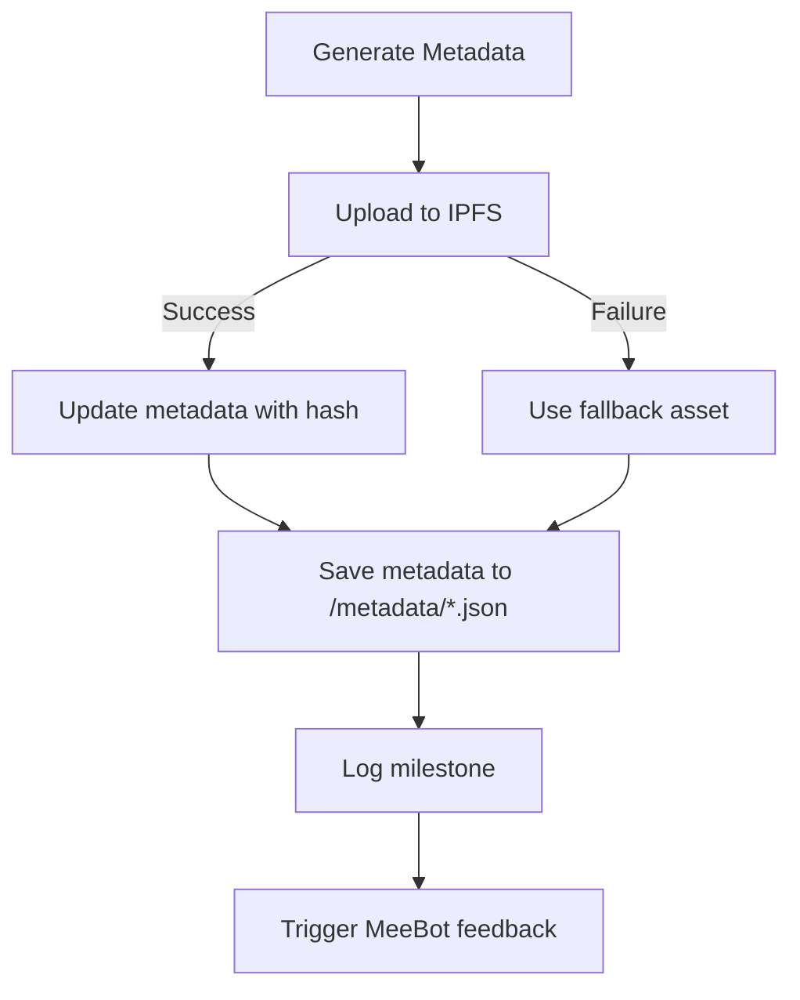

# IPFS Uploader - Metadata Generator Integration

Fallback-aware IPFS uploader with metadata generation and MeeBot sprite feedback for MeeChain NFT badge minting system.

## 📁 Directory Structure

```
copilot/
├── ipfs-uploader/
│   ├── index.cjs                    # Main uploader (integrates everything)
│   ├── metadata-generator.cjs       # NFT metadata generator
│   ├── config.cjs                   # Fallback-aware configuration
│   ├── test-fallback.cjs            # Fallback scenario test
│   ├── demo-meebot-integration.cjs  # MeeBot integration demo
│   ├── utils/
│   │   └── hash.cjs                 # IPFS hash generation & validation
│   └── metadata/                    # Generated metadata files (auto-created)
│       ├── milestone-1.json
│       ├── milestone-2.json
│       └── quest-tts-001.json
├── assets/
│   ├── badges/                      # Badge image files to upload
│   │   ├── milestone-1.svg
│   │   ├── milestone-2.svg
│   │   └── quest-tts-001.svg
│   └── fallback/                    # Fallback assets
│       └── default-badge.svg
└── milestone.log                    # Milestone tracking (triggers MeeBot feedback)
```

## 🚀 Quick Start

### Upload All Badges

```bash
cd /home/runner/work/MeeChain_MeeBot/MeeChain_MeeBot
node copilot/ipfs-uploader/index.cjs
```

### Upload Single File

```javascript
const { uploadFile } = require('./copilot/ipfs-uploader/index.cjs');

const result = await uploadFile('copilot/assets/badges/milestone-1.svg', {
  questId: 'quest-001',
  rarity: 'Legendary',
  description: 'First milestone badge'
});

console.log(result.metadata);
```

### Test Fallback Scenario

```bash
node copilot/ipfs-uploader/test-fallback.cjs
```

### Run MeeBot Integration Demo

```bash
node copilot/ipfs-uploader/demo-meebot-integration.cjs
```

## 🧠 How It Works

### 1. Metadata Generation (`metadata-generator.cjs`)

Generates NFT-compliant metadata with fallback support:

```javascript
const { generateMetadata } = require('./metadata-generator.cjs');

const metadata = generateMetadata('milestone-1.svg', {
  questId: 'quest-001',
  rarity: 'Common',
  description: 'Custom description'
});

// Output:
{
  name: 'Badge: milestone-1',
  description: 'Custom description',
  image: '',  // Filled after upload
  fallback_image: 'fallback://path/to/fallback.svg',
  attributes: [
    { trait_type: 'Milestone', value: 'milestone-1' },
    { trait_type: 'Quest', value: 'quest-001' },
    { trait_type: 'Rarity', value: 'Common' },
    { trait_type: 'Uploader', value: 'MeeChain' },
    { trait_type: 'Network', value: 'IPFS' }
  ]
}
```

### 2. IPFS Upload (`index.cjs`)

Main uploader integrates metadata generator:

```javascript
const { uploadBadge } = require('./index.cjs');

// Upload with automatic metadata generation
const result = await uploadBadge('path/to/badge.svg');

if (result.success && !result.fallback) {
  console.log(`Uploaded to: ipfs://${result.hash}`);
} else if (result.fallback) {
  console.log('Using fallback asset');
}
```

### 3. Hash Validation (`utils/hash.cjs`)

Validates IPFS hashes and simulates upload:

```javascript
const { uploadToIPFS, validateHash } = require('./utils/hash.cjs');

const hash = await uploadToIPFS('file.svg');
const isValid = validateHash(hash);  // Check CIDv0/CIDv1 format
```

## 🛡️ Fallback-Aware Flow



**Flow Steps:**

1. **Generate metadata** → `generateMetadata()` creates base metadata
2. **Upload to IPFS** → `uploadToIPFS()` attempts upload
3. **Success path** → Update metadata with IPFS hash
4. **Failure path** → Use fallback asset path
5. **Save metadata** → Write to `/metadata/*.json`
6. **Log milestone** → Append to `milestone.log`
7. **MeeBot feedback** → Trigger sprite response (🎉)

## 🎯 MeeBot Integration

The uploader integrates with MeeBot sprite feedback:

```javascript
// In production, import from components/MeeBot.tsx
import { MeeBot } from '../components/MeeBot';

const result = await uploadFile('badge.svg');

if (result.success && !result.fallback) {
  MeeBot.setSprite('happy');
  MeeBot.speak('ยินดีด้วย! อัปโหลดสำเร็จ NFT metadata พร้อมแล้ว!');
} else if (result.fallback) {
  MeeBot.setSprite('confused');
  MeeBot.speak('ระบบ fallback ทำงานแล้วนะครับ แต่ metadata ก็ถูกสร้างเรียบร้อยแล้ว!');
}
```

### MeeBot Sprite States

- `loading` - กำลังอัปโหลด
- `happy` - อัปโหลดสำเร็จ
- `confused` - ใช้ fallback
- `sad` - อัปโหลดล้มเหลว

## 📊 Milestone Logging

Every upload batch logs to `milestone.log`:

```
[2025-10-10T03:30:11.048Z] M4 complete: Uploader tested - 3 uploaded, 0 fallback, 0 failed 🟠
```

This triggers MeeBot to provide feedback on milestone completion.

## ⚙️ Configuration (`config.cjs`)

Customize paths and behavior:

```javascript
const config = {
  BADGE_DIR: 'copilot/assets/badges',
  FALLBACK_DIR: 'copilot/assets/fallback',
  METADATA_DIR: 'copilot/ipfs-uploader/metadata',
  MILESTONE_LOG: 'copilot/milestone.log',
  
  // Fallback settings
  USE_FALLBACK_ON_ERROR: true,
  FALLBACK_PREFIX: 'fallback://',
  
  // IPFS settings
  MAX_RETRIES: 3,
  RETRY_DELAY: 1000,
  UPLOAD_TIMEOUT: 30000
};
```

## 📝 Generated Metadata Example

`copilot/ipfs-uploader/metadata/milestone-1.json`:

```json
{
  "name": "Badge: milestone-1",
  "description": "NFT badge for milestone-1",
  "image": "ipfs://Qm9972eeb37503864f60886d81d5a0c7673b4dc1d55872",
  "fallback_image": "fallback:///path/to/fallback.svg",
  "attributes": [
    { "trait_type": "Milestone", "value": "milestone-1" },
    { "trait_type": "Uploader", "value": "MeeChain" },
    { "trait_type": "Network", "value": "IPFS" }
  ]
}
```

## 🧪 Testing

### Test Successful Upload

```bash
node copilot/ipfs-uploader/index.cjs
```

### Test Fallback Mechanism

```bash
node copilot/ipfs-uploader/test-fallback.cjs
```

### Test MeeBot Integration

```bash
node copilot/ipfs-uploader/demo-meebot-integration.cjs
```

## 🔗 Integration with Minting System

Connect uploader with NFT minting:

```javascript
const { uploadFile } = require('./copilot/ipfs-uploader/index.cjs');
const { mintBadge } = require('./src/QuestManager');

async function mintNFTWithMetadata(userId, questId, badgeFile) {
  // 1. Upload badge and generate metadata
  const result = await uploadFile(badgeFile, { questId });
  
  // 2. Mint NFT with metadata URI
  const metadataURI = `ipfs://metadata/${result.metadata.name}.json`;
  const tx = await mintBadge(userId, questId, metadataURI);
  
  // 3. Provide MeeBot feedback
  MeeBot.questFeedback(questId, true, result.fallback);
  
  return { tx, metadata: result.metadata };
}
```

## 🎨 Adding New Badges

1. Add badge image to `copilot/assets/badges/`
2. Run uploader: `node copilot/ipfs-uploader/index.cjs`
3. Metadata auto-generated in `copilot/ipfs-uploader/metadata/`
4. Milestone logged to `copilot/milestone.log`
5. MeeBot provides feedback 🎉

## 🔧 Production Deployment

For production with real IPFS:

1. Install IPFS client: `npm install ipfs-http-client`
2. Update `utils/hash.cjs` to use real IPFS API
3. Configure IPFS node in `config.cjs`
4. Deploy to IPFS gateway (Pinata, Infura, etc.)

## 📚 API Reference

### `uploadFile(filePath, options)`

Upload a single file with metadata generation.

**Parameters:**
- `filePath` (string) - Path to badge file
- `options` (object) - Optional metadata options
  - `questId` (string) - Quest ID
  - `rarity` (string) - Badge rarity
  - `description` (string) - Custom description
  - `attributes` (array) - Additional attributes

**Returns:**
```javascript
{
  success: true,
  file: 'badge.svg',
  hash: 'Qm...',
  metadata: { ... },
  fallback: false
}
```

### `uploadAllBadges()`

Upload all badges in the badge directory.

**Returns:**
```javascript
{
  total: 3,
  successful: 3,
  fallback: 0,
  failed: 0,
  results: [ ... ]
}
```

### `generateMetadata(fileName, options)`

Generate NFT metadata for a badge.

**Returns:** Metadata object with fallback support.

---

## ✅ Integration Checklist

- [x] Metadata generator (`metadata-generator.cjs`)
- [x] IPFS uploader (`index.cjs`)
- [x] Hash validation (`utils/hash.cjs`)
- [x] Fallback-aware configuration
- [x] Milestone logging
- [x] MeeBot sprite feedback hooks
- [x] Test scripts (fallback & integration)
- [x] Sample badge files
- [x] Auto-created metadata directory
- [x] Documentation

🎉 **System ready for complete NFT minting workflow!**
