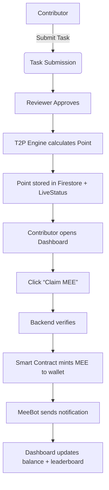
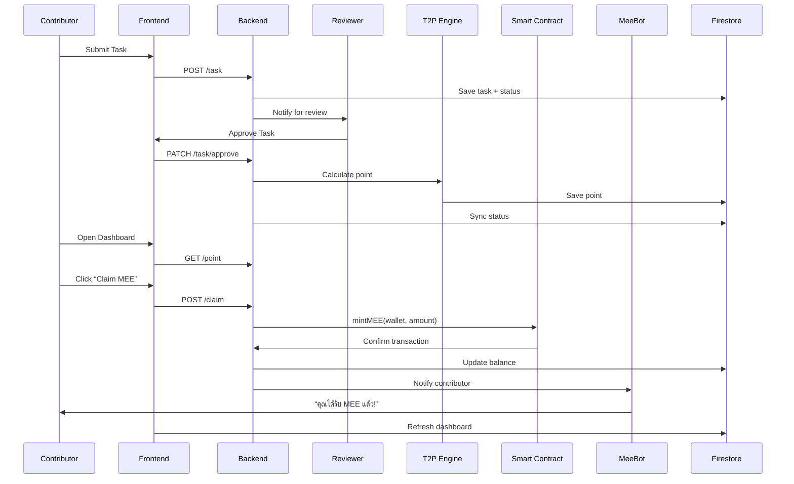

---
# T2P → MEE Claim Flow (Mermaid)



---
# Sequence Diagram: Claim MEE Flow (Mermaid)



---
# PNG Export

> คุณสามารถนำ Mermaid diagram ข้างต้นไป paste ที่ https://mermaid.live หรือ VS Code Mermaid plugin แล้ว export เป็น PNG ได้ทันที

---
# ตัวอย่างโค้ด endpoint (Node.js/Express)

```ts
// Claim MEE endpoint
import { mintMEE } from './mintMEE';
app.post('/claim', async (req, res) => {
  const { wallet, amount } = req.body;
  // ตรวจสอบสิทธิ์/point ก่อน mint จริง
  // ...validation logic...
  try {
    const txHash = await mintMEE(wallet, amount);
    // update Firestore, leaderboard, notify MeeBot ...
    res.json({ success: true, txHash });
  } catch (e) {
    res.status(500).json({ success: false, error: e.message });
  }
});
```

---
# ตัวอย่างโค้ด Smart Contract (Solidity)

```solidity
// MEE.sol (ERC20 + mint role)
function mint(address to, uint256 amount) public onlyMinter {
    _mint(to, amount);
}
```
