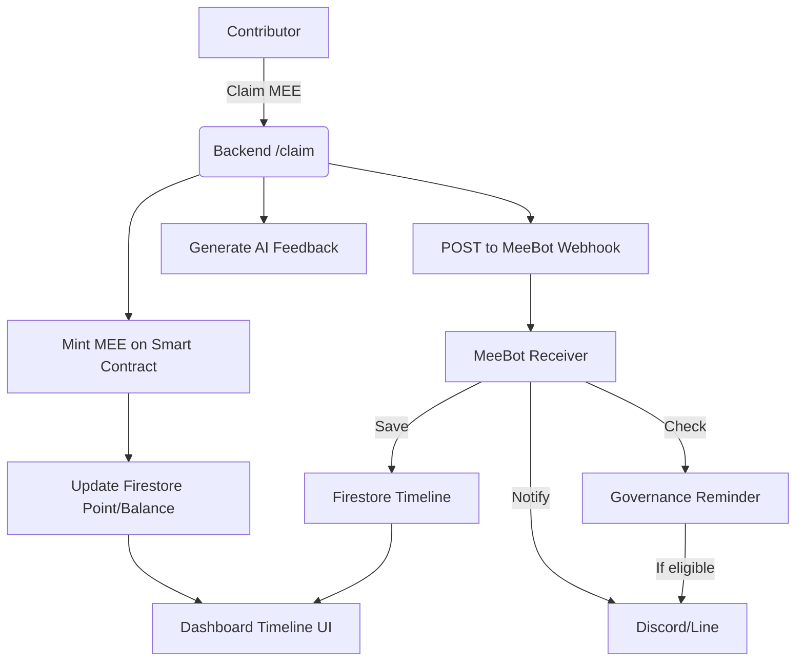

---
# MeeBot Integration Flow Diagram (Mermaid)

---
# คำอธิบาย
- Contributor เคลม MEE → backend mint เหรียญ, update Firestore, generate feedback
- Backend POST event ไปยัง MeeBot Webhook
- MeeBot Receiver: save timeline, notify Discord/Line, ตรวจสอบ governance
- Dashboard UI ดึงข้อมูล timeline และ balance จาก Firestore แบบ realtime

---
# วิธีใช้งาน
- สามารถนำ Mermaid diagram นี้ไป paste ที่ https://mermaid.live หรือใช้ Mermaid plugin ใน VS Code เพื่อดู flow และ export PNG ได้ทันที
